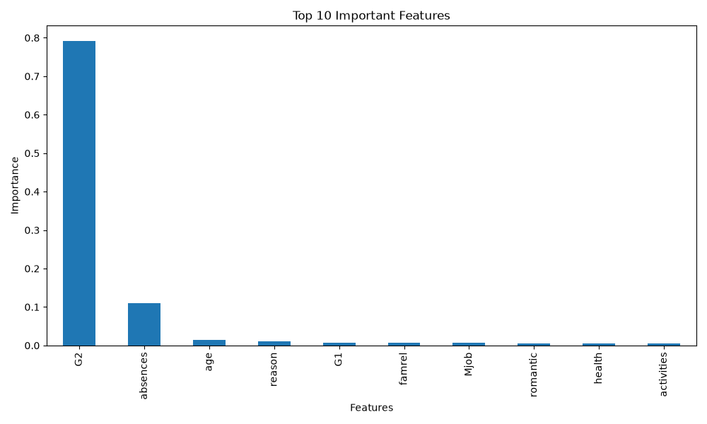
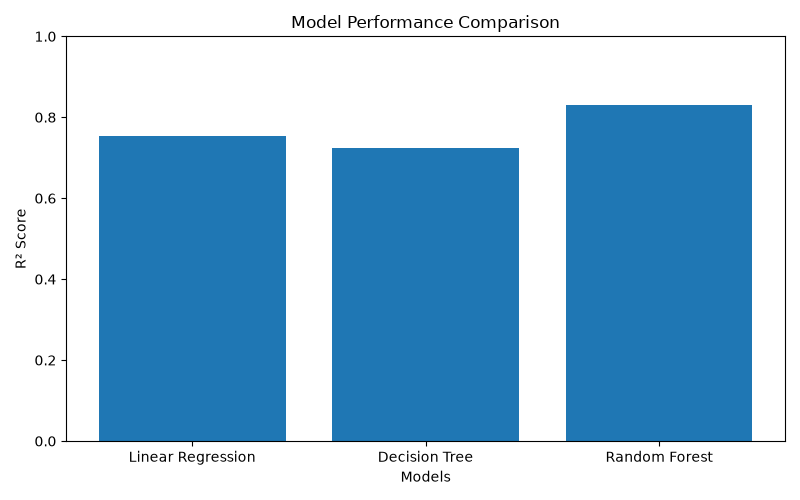

# 🎓 Student Performance Prediction

A Machine Learning web application that predicts a student's final academic grade based on academic, demographic, and behavioral information.

The project uses multiple Machine Learning algorithms and integrates the best-performing model into a Streamlit web application for real-time prediction.

---

## 📌 Project Overview

Student performance can be influenced by several factors such as study time, previous grades, absences, family background, and other personal and academic characteristics.

This project analyzes these factors and builds Machine Learning models to predict the student's final grade (G3).

The trained model is integrated with a Streamlit application where users can enter student information and receive a predicted final grade.

---

## 🎯 Objectives

- Analyze factors affecting student performance.
- Perform Exploratory Data Analysis (EDA).
- Preprocess the student dataset.
- Train multiple Machine Learning models.
- Compare model performance using evaluation metrics.
- Identify important features affecting prediction.
- Deploy the best-performing model through a Streamlit application.
- Provide an easy-to-use student performance prediction interface.

---

## 🧠 Machine Learning Models

The following regression models were evaluated:

1. Decision Tree Regressor
2. Random Forest Regressor
3. Linear Regression

### Best Model

Based on the evaluation results, **Random Forest Regressor** performed the best.

| Model | MAE | MSE | R² Score |
|---|---:|---:|---:|
| Decision Tree | 1.3038 | 5.6582 | 0.7241 |
| Random Forest | **1.1051** | **3.4867** | **0.8300** |
| Linear Regression | 1.4955 | 5.0324 | 0.7546 |

Random Forest achieved an **R² score of 0.83**, making it the best-performing model among the evaluated models.

---

## 📊 Exploratory Data Analysis

The project includes several EDA visualizations:

- Correlation heatmap
- Feature distributions
- Feature relationships
- Feature importance
- Model comparison

### Feature Importance

The feature importance analysis helps identify which variables contribute most to predicting the final grade.



### Model Comparison



---

## 🖥️ Streamlit Application

The trained model is integrated into a Streamlit web application.

Users can enter:

- School
- Gender
- Age
- Address
- Family size
- Parent status
- Mother education
- Father education
- Travel time
- Study time
- Previous class failures
- Absences
- First period grade (G1)
- Second period grade (G2)

The application then predicts the student's final grade out of 20.

### Application Features

- 📋 Student information input
- 🤖 Machine Learning prediction
- 📊 Performance classification
- 📈 Prediction progress indicator
- 📝 Student summary
- 📜 Prediction history
- ⚠️ Prediction range/uncertainty information

---

## 📁 Project Structure

```text
Student-Performance-Prediction/
│
├── data/
│   ├── raw/
│   └── processed/
│
├── models/
│   └── student_performance_model.pkl
│
├── notebooks/
│   └── EDA.ipynb
│
├── reports/
│   ├── feature_importance.png
│   ├── model_comparison.png
│   └── model_performance.csv
│
├── src/
│   ├── data_preprocessing.py
│   ├── predict.py
│   └── train_model.py
│
├── app.py
├── README.md
├── requirements.txt
├── LICENSE
└── .gitignore